# VideoComputePipeline Architecture Diagrams

Branch documented: `feature/cuda-yolo-nv12-inference`

This document is written as codebase documentation for a mostly C/CUDA/C++ modular project. The diagrams are therefore **module, data-structure, memory-flow, and sequence diagrams**, rather than pure object-oriented class diagrams.

Grounding note: these diagrams are based on the branch README and public source files visible on GitHub, especially `pipeline_runner.c`, `pipeline_config.h`, `frame.h`, `cuda_frame.h`, `inference_engine.h`, `video_reader.h`, `video_writer.h`, `video_hw_reader.h`, `video_hw_writer.h`, `cuda_overlay.h`, `benchmark.h`, and `CMakeLists.txt`.

---

## 1. Project-Level Component Diagram

```mermaid
flowchart TB
    CLI["main.c / CLI arguments"] --> Config["PipelineConfig\ninclude/pipeline/pipeline_config.h\nsrc/pipeline/pipeline_config.c"]
    Config --> Runner["Pipeline Runner\nsrc/pipeline/pipeline_runner.c"]

    Runner --> FilterPath["Filter task\nPIPELINE_TASK_FILTER"]
    Runner --> DetectPath["Detection task\nPIPELINE_TASK_DETECT"]

    subgraph CoreFrame["Core frame and memory structures"]
        Frame["Frame\nRGB24 / GRAY8 / NV12\ninclude/core/frame.h"]
        CudaFrame["CudaNV12Frame\nGPU NV12 frame wrapper\ninclude/gpu/cuda_frame.h"]
        Pool["FramePool / FrameQueue / FrameSlot\nsrc/pipeline/frame_pool.c\nsrc/pipeline/frame_queue.c\nsrc/pipeline/frame_slot.c"]
    end

    subgraph VideoCPU["CPU video I/O"]
        Reader["VideoReader\nFFmpeg CPU decode\ninclude/video/video_reader.h"]
        Writer["VideoWriter\nFFmpeg CPU frame encode\ninclude/video/video_writer.h"]
    end

    subgraph VideoHW["Hardware video I/O"]
        HWReader["VideoHWReader\nNVDEC/CUDA frame decode\ninclude/video/video_hw_reader.h"]
        HWWriter["VideoHWWriter\nNVENC/CUDA frame encode\ninclude/video/video_hw_writer.h"]
    end

    subgraph Processing["Processing engines"]
        CPUFilters["CPU filters\nsrc/cpu/cpu_filters.c"]
        OpenCLFilters["OpenCL filters\nsrc/gpu/gpu_filters.c\nkernels/*.cl"]
        TRT["InferenceEngine\nTensorRT backend or stub\ninclude/inference/inference_engine.h"]
        Overlay["CUDA Overlay\nNV12 box drawing\ninclude/gpu/cuda_overlay.h"]
    end

    subgraph Output["Output and reporting"]
        DetectionResult["DetectionResult\ninclude/inference/detection_result.h"]
        DetectionWriter["DetectionWriter\nCSV output\ninclude/inference/detection_writer.h"]
        Benchmark["Benchmark / FrameTiming\ninclude/benchmark/benchmark.h"]
        MatrixReport["Matrix report\nsrc/benchmark/matrix_report.c"]
    end

    FilterPath --> Reader
    FilterPath --> Pool
    FilterPath --> CPUFilters
    FilterPath --> OpenCLFilters
    FilterPath --> Writer
    FilterPath --> Benchmark

    DetectPath --> Reader
    DetectPath --> HWReader
    DetectPath --> TRT
    DetectPath --> Overlay
    DetectPath --> HWWriter
    DetectPath --> DetectionResult
    DetectPath --> DetectionWriter
    DetectPath --> Benchmark

    Reader --> Frame
    Writer --> Frame
    HWReader --> CudaFrame
    HWWriter --> CudaFrame
    TRT --> DetectionResult
    Overlay --> CudaFrame
```

### Explanation

The codebase has two main runtime tasks:

- `PIPELINE_TASK_FILTER`: the original benchmark pipeline for CPU/OpenCL filters and encoded video output.
- `PIPELINE_TASK_DETECT`: the TensorRT detection path, with both CPU-decoded NV12 fallback and an experimental NVDEC/CUDA/NVENC hardware path.

The most important architectural split is between **CPU frame flow** using `Frame` and **GPU-resident hardware video flow** using `CudaNV12Frame`.

---

## 2. Build Option / Feature Flag Diagram

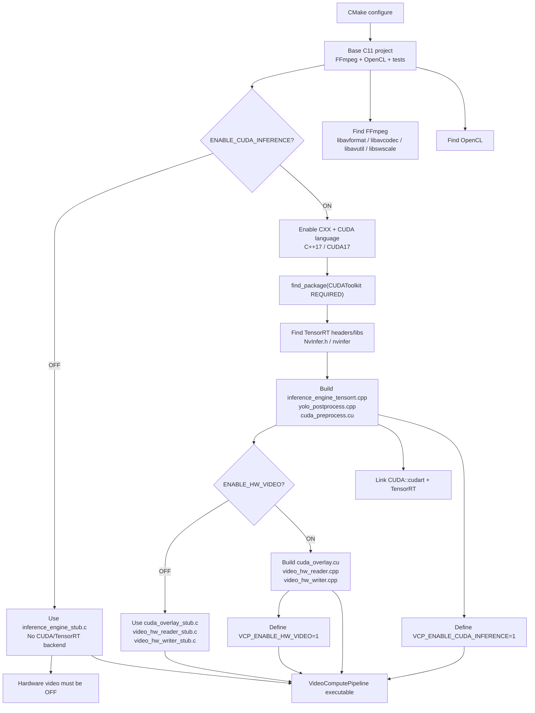

### Explanation

`ENABLE_CUDA_INFERENCE` controls whether the real TensorRT/CUDA inference backend is built. `ENABLE_HW_VIDEO` controls whether the real NVDEC/NVENC hardware-video files are built. Hardware video requires CUDA inference to be enabled. If hardware video is disabled, stub implementations are built for overlay, hardware reader, and hardware writer.

---

## 3. CLI Argument to PipelineConfig Diagram

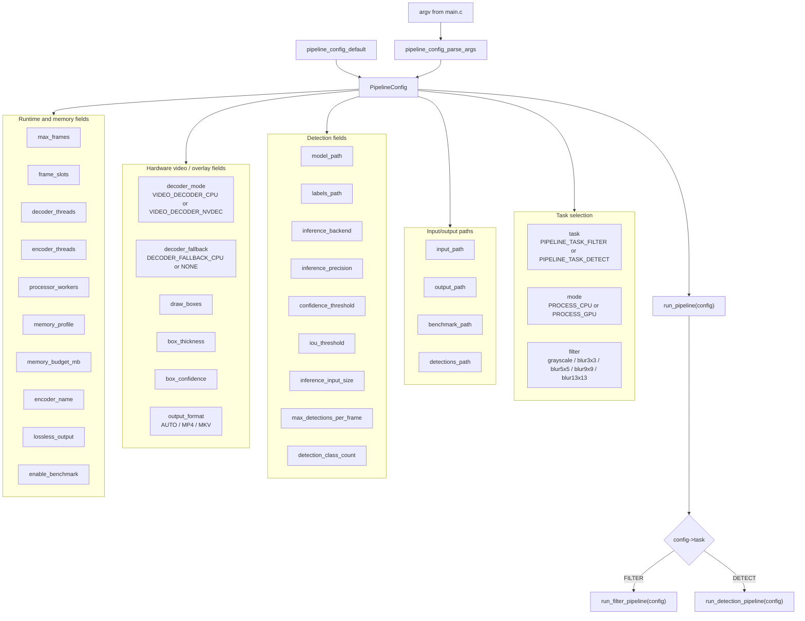

### Explanation

`PipelineConfig` is the central control object. It carries both the old filter-pipeline controls and the newer detection/hardware-video controls. The detection path depends on model, labels, detection CSV, thresholds, input size, decoder mode, draw-box settings, and optional output video settings.

---

## 4. Source-Level Pipeline Selection Diagram

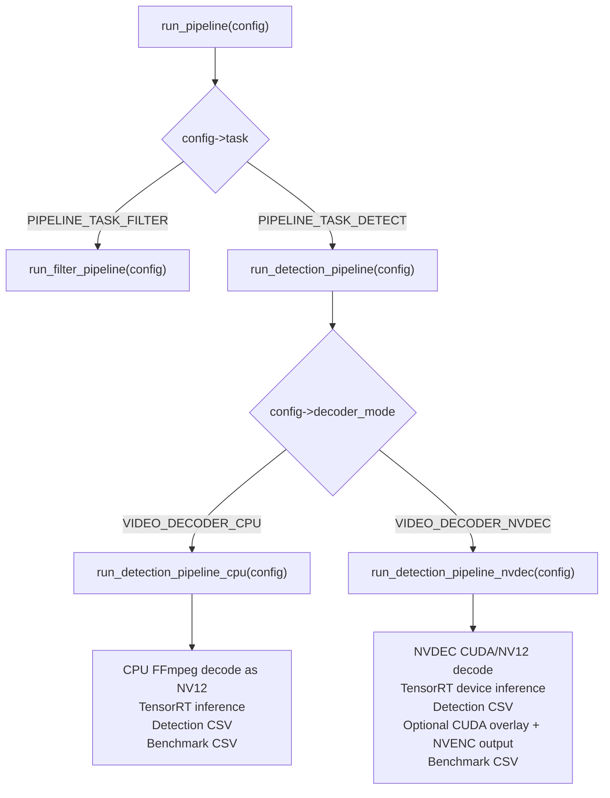

### Explanation

The source declares separate static functions for the filter pipeline, detection dispatcher, CPU detection pipeline, and NVDEC detection pipeline. This is a clean split: the new hardware path does not have to disturb the old CPU/OpenCL filter path.

---

## 5. CPU/OpenCL Filter Pipeline Data Flow

```mermaid
flowchart LR
    Input["Input video file"] --> Reader["VideoReader\nvideo_reader_open_with_threads"]
    Reader --> Decode["FFmpeg CPU decode"]
    Decode --> RGBFrame["Frame\nformat usually RGB24"]

    RGBFrame --> RawPool["Raw frame pool"]
    RawPool --> RawQueue["Raw queue"]
    RawQueue --> Processor{"config->mode"}

    Processor -- "PROCESS_CPU" --> CPUFilter["CPU filter\ngrayscale / blur"]
    Processor -- "PROCESS_GPU" --> OpenCLUpload["OpenCL upload"]
    OpenCLUpload --> OpenCLKernel["OpenCL filter kernel"]
    OpenCLKernel --> OpenCLDownload["OpenCL download"]

    CPUFilter --> ProcessedFrame["Processed Frame"]
    OpenCLDownload --> ProcessedFrame

    ProcessedFrame --> ProcessedPool["Processed frame pool"]
    ProcessedPool --> ProcessedQueue["Processed queue"]
    ProcessedQueue --> OrderedWriter["Ordered encoder stage"]
    OrderedWriter --> Writer["VideoWriter\nvideo_writer_write_frame"]
    Writer --> Encoded["Encoded packets"]
    Encoded --> Output["Output MP4/MKV"]

    OrderedWriter --> Timing["FrameTiming"]
    Timing --> Benchmark["Benchmark CSV"]
```

### Explanation

The original filter path uses CPU-side `Frame` objects and bounded pools/queues. GPU mode here means the frame is uploaded to OpenCL for filtering and downloaded back to CPU memory before the regular FFmpeg writer encodes it. This is separate from the newer CUDA/NVDEC/NVENC hardware path.

---

## 6. CPU-Decoded TensorRT Detection Flow

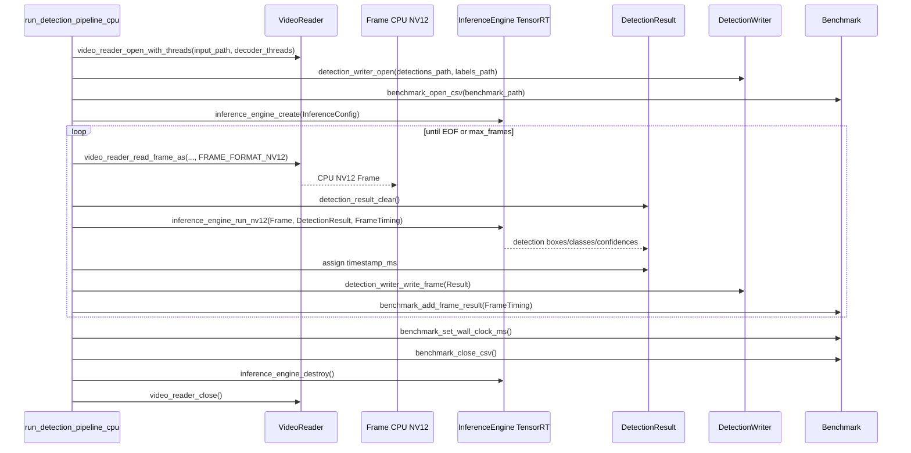

### Explanation

This is the safer fallback detection path. It decodes to a CPU `Frame` in NV12 format, then calls `inference_engine_run_nv12`. The TensorRT backend may perform CUDA upload and preprocessing internally. It writes detections and timings, but this path does **not** encode annotated video.

---

## 7. NVDEC + TensorRT + CUDA Overlay + NVENC Hardware Flow

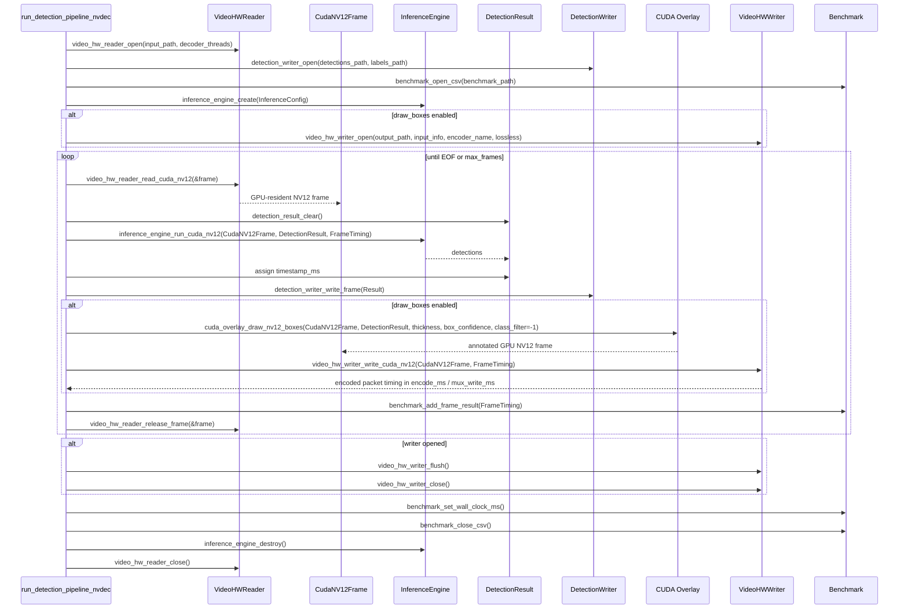

### Explanation

This is the high-performance path. A CUDA/NV12 frame is decoded by the hardware reader, passed directly into `inference_engine_run_cuda_nv12`, optionally annotated by `cuda_overlay_draw_nv12_boxes`, and optionally encoded by `video_hw_writer_write_cuda_nv12`. The goal of this path is to avoid full-frame CPU/GPU copies.

---

## 8. CPU Memory vs GPU Memory Movement Diagram

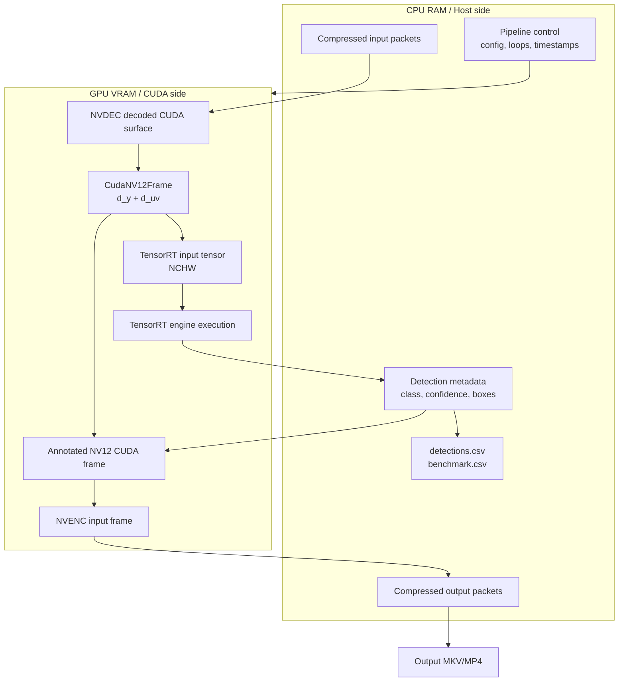

### Explanation

The final hardware path should keep raw decoded frames in GPU memory. The CPU still controls the pipeline, writes CSV, and handles compressed file I/O, but should not receive full raw 4K frames unless a fallback/debug path is used.

---

## 9. Key Data Structures Diagram

```mermaid
classDiagram
    class PipelineConfig {
        char input_path[]
        char output_path[]
        char benchmark_path[]
        char detections_path[]
        char model_path[]
        char labels_path[]
        char inference_backend[]
        char inference_precision[]
        char encoder_name[]
        PipelineTask task
        ProcessMode mode
        FilterType filter
        VideoDecoderMode decoder_mode
        DecoderFallbackMode decoder_fallback
        OutputFormat output_format
        int draw_boxes
        int box_thickness
        float box_confidence
        float confidence_threshold
        float iou_threshold
        int inference_input_size
        int max_frames
    }

    class Frame {
        int index
        int width
        int height
        int channels
        FrameFormat format
        size_t stride
        size_t size
        uint8_t* data
        uint8_t* planes[4]
        size_t linesize[4]
    }

    class CudaNV12Frame {
        int index
        int width
        int height
        int64_t pts
        int64_t dts
        double timestamp_ms
        uint8_t* d_y
        uint8_t* d_uv
        size_t y_pitch
        size_t uv_pitch
        void* cuda_stream
        void* av_frame
        void* hw_frames_ctx
        int owns_av_frame
        int owns_cuda_memory
    }

    class InferenceConfig {
        char model_path[]
        char labels_path[]
        int input_width
        int input_height
        int class_count
        float confidence_threshold
        float iou_threshold
        int use_fp16
    }

    class FrameTiming {
        int frame_index
        double decode_ms
        double process_ms
        double upload_ms
        double kernel_ms
        double download_ms
        double encode_ms
        double total_ms
        double preprocess_ms
        double inference_ms
        double postprocess_ms
        double overlay_ms
        double mux_write_ms
    }

    class Benchmark {
        FrameTiming* items
        size_t count
        size_t capacity
        double wall_clock_ms
        void* csv_file
    }

    PipelineConfig --> InferenceConfig : creates for detection
    FrameTiming --> Benchmark : accumulated into
    Frame --> "CPU VideoReader/VideoWriter" : used by
    CudaNV12Frame --> "VideoHWReader/VideoHWWriter" : used by
    CudaNV12Frame --> "InferenceEngine/CUDA Overlay" : consumed by
```

### Explanation

`Frame` is the CPU-side frame representation. `CudaNV12Frame` is the GPU-resident frame representation for the hardware path. `PipelineConfig` selects the task, decoder, encoder, detection thresholds, and overlay behavior. `FrameTiming` records per-frame timing, and `Benchmark` stores/writes timing data.

---

## 10. CPU Frame Format Diagram

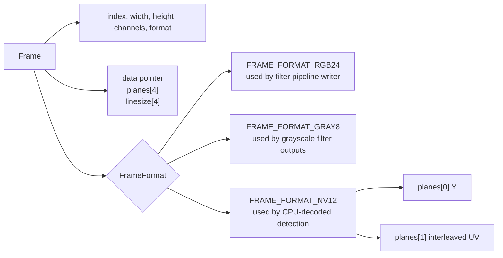

### Explanation

The branch added/uses `FRAME_FORMAT_NV12`, which lets the CPU detection fallback read decoded video in NV12 form before TensorRT preprocessing. The regular filter output path still works through CPU-side frames and the regular `VideoWriter`.

---

## 11. CUDA NV12 Frame Ownership Diagram

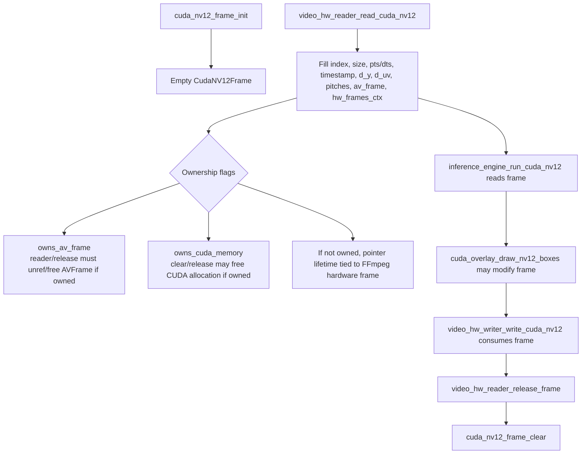

### Explanation

The hardware path depends on clear frame lifetime rules. The decoded CUDA frame must remain valid until inference, overlay, and encoding are done. In the current sequential hardware loop, the frame is released after detection writing, optional overlay, optional NVENC encoding, and benchmark logging.

---

## 12. Inference Engine API Diagram

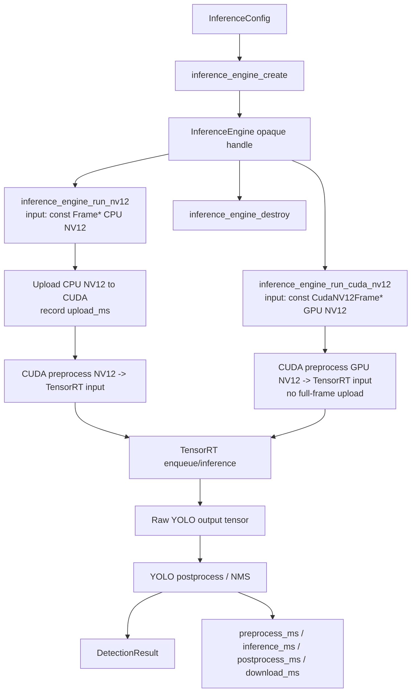

### Explanation

The public API exposes two inference paths: a CPU-NV12 path and a CUDA-NV12 path. The CUDA path is the important one for NVDEC integration because it avoids re-uploading the full frame.

---

## 13. Detection CSV Flow Diagram

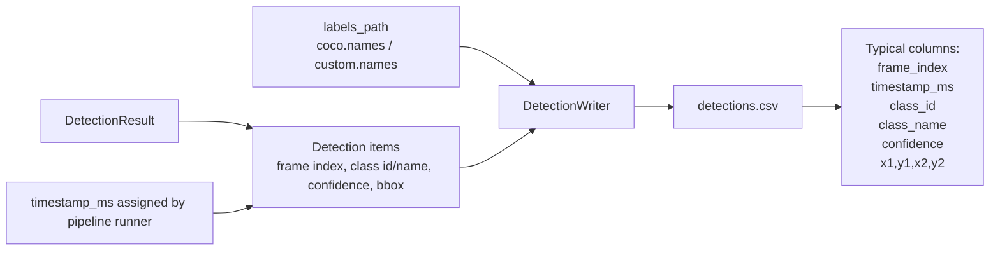

### Explanation

Both detection paths write detection metadata through `DetectionWriter`. The hardware path still writes CSV even when annotated video is disabled.

---

## 14. Benchmark Timing Flow Diagram

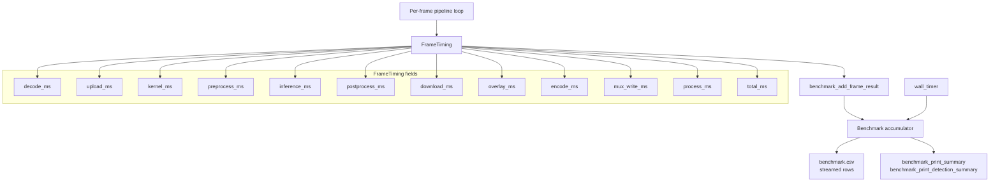

### Explanation

The branch extends timing beyond the original decode/process/encode timing. Detection and hardware-video timing fields include `preprocess_ms`, `inference_ms`, `postprocess_ms`, `overlay_ms`, and `mux_write_ms`. In the NVDEC path, upload/download should be zero or not used unless internal implementation requires small transfers.

---

## 15. Hardware Detection Frame Loop Diagram

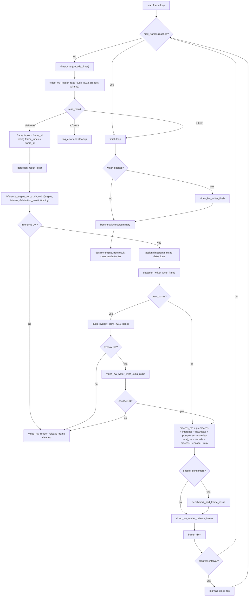

### Explanation

This diagram expands the exact hardware detection loop. The code reads a CUDA/NV12 frame, runs device inference, writes detections, optionally draws boxes and encodes, updates benchmark timing, then releases the hardware frame.

---

## 16. CUDA Overlay Flow Diagram

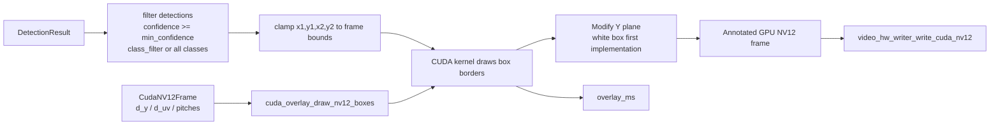

### Explanation

The overlay API receives a GPU-resident NV12 frame and detection results. The initial practical approach is to draw simple visible boxes by modifying the Y plane. Color overlays can be added later by modifying UV as well.

---

## 17. Video Reader / Writer Module Diagram

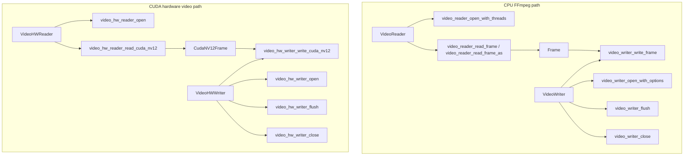

### Explanation

The repo now contains separate CPU and hardware video reader/writer APIs. The CPU path uses `Frame`. The hardware path uses `CudaNV12Frame`.

---

## 18. Fallback and Capability Matrix

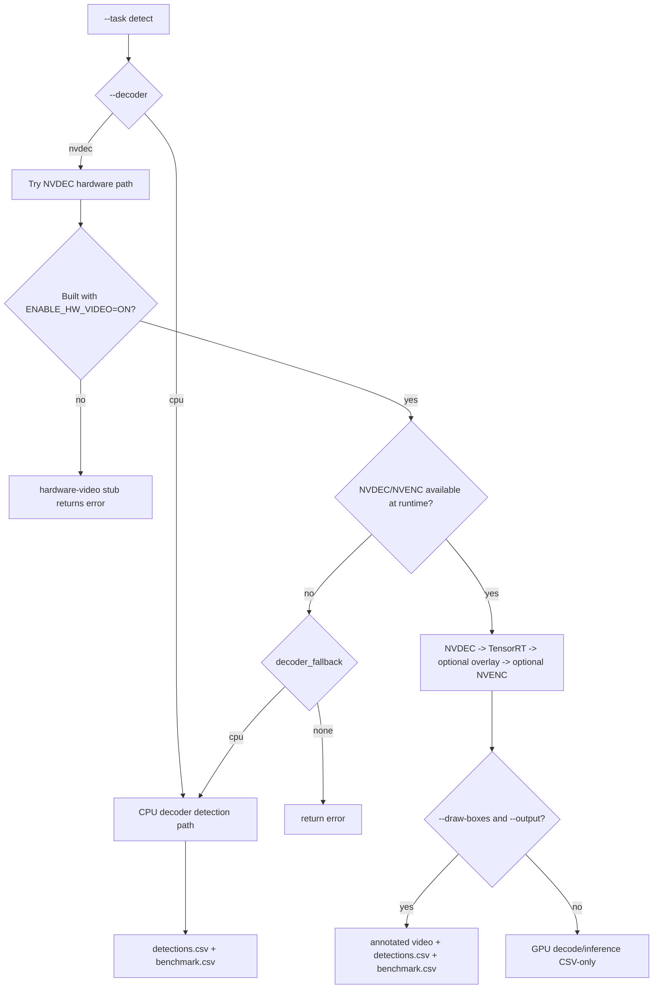

### Explanation

The intended behavior is to keep CPU detection as fallback while hardware-video support remains optional. The exact runtime fallback behavior should be verified during local testing, but the config includes both decoder mode and decoder fallback fields.

---

## 19. Output Modes Diagram

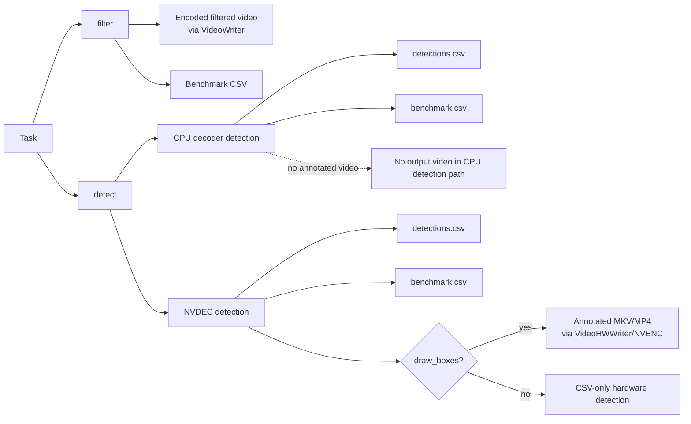

### Explanation

The README currently contains a small wording contradiction: it documents experimental annotated detection with an output file, while also saying detection mode skips video encoding. The factual distinction is: CPU/CSV-only detection skips video encoding; hardware detection can produce annotated video when `--draw-boxes` and output writer options are used.

---

## 20. Suggested README Architecture Section Diagram

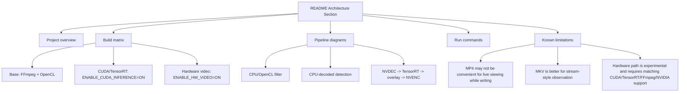

### Explanation

For repo documentation, these diagrams should probably live in `docs/architecture_diagrams.md`, with a shorter overview copied into `README.md`.

---

## 21. File-to-Responsibility Map

```mermaid
flowchart LR
    subgraph ConfigFiles["Configuration"]
        PCfgH["include/pipeline/pipeline_config.h"]
        PCfgC["src/pipeline/pipeline_config.c"]
    end

    subgraph PipelineFiles["Pipeline orchestration"]
        Runner["src/pipeline/pipeline_runner.c"]
        Pool["src/pipeline/frame_pool.c"]
        Queue["src/pipeline/frame_queue.c"]
        Slot["src/pipeline/frame_slot.c"]
    end

    subgraph CoreFiles["Frame memory"]
        FrameH["include/core/frame.h"]
        FrameC["src/core/frame.c"]
        CudaFrameH["include/gpu/cuda_frame.h"]
        CudaFrameC["src/gpu/cuda_frame.c"]
    end

    subgraph VideoFiles["Video I/O"]
        ReaderH["include/video/video_reader.h"]
        ReaderC["src/video/video_reader.c"]
        WriterH["include/video/video_writer.h"]
        WriterC["src/video/video_writer.c"]
        HWReaderH["include/video/video_hw_reader.h"]
        HWReaderC["src/video/video_hw_reader.cpp"]
        HWWriterH["include/video/video_hw_writer.h"]
        HWWriterC["src/video/video_hw_writer.cpp"]
    end

    subgraph ProcessingFiles["Processing"]
        CPUF["src/cpu/cpu_filters.c"]
        GPF["src/gpu/gpu_filters.c"]
        OCL["src/gpu/opencl_context.c / opencl_program.c"]
        InferH["include/inference/inference_engine.h"]
        InferCPP["src/inference/inference_engine_tensorrt.cpp"]
        PreCU["src/inference/cuda_preprocess.cu"]
        PostCPP["src/inference/yolo_postprocess.cpp"]
        OverlayH["include/gpu/cuda_overlay.h"]
        OverlayCU["src/gpu/cuda_overlay.cu"]
    end

    subgraph OutputFiles["CSV and benchmark"]
        DetRH["include/inference/detection_result.h"]
        DetRC["src/inference/detection_result.c"]
        DetWH["include/inference/detection_writer.h"]
        DetWC["src/inference/detection_writer.c"]
        BenchH["include/benchmark/benchmark.h"]
        BenchC["src/benchmark/benchmark.c"]
    end

    PCfgH --> Runner
    PCfgC --> Runner
    Runner --> CoreFiles
    Runner --> VideoFiles
    Runner --> ProcessingFiles
    Runner --> OutputFiles
```

### Explanation

This map is useful for maintenance and code review. It shows which modules are responsible for configuration, orchestration, frame memory, video I/O, filtering/inference/overlay, and reporting.

---

## 22. Recommended Integration View

```mermaid
flowchart TD
    Main["main branch\noriginal filter benchmark"] --> Merge["merge feature/cuda-yolo-nv12-inference"]
    Feature["feature branch\nCUDA/TensorRT + NVDEC/NVENC detection"] --> Merge

    Merge --> Tests["Run test matrix"]

    Tests --> Build1["Base build\nENABLE_CUDA_INFERENCE=OFF"]
    Tests --> Build2["CUDA build\nENABLE_CUDA_INFERENCE=ON"]
    Tests --> Build3["Hardware build\nENABLE_CUDA_INFERENCE=ON\nENABLE_HW_VIDEO=ON"]

    Tests --> Smoke1["CPU filter smoke test"]
    Tests --> Smoke2["OpenCL GPU filter smoke test"]
    Tests --> Smoke3["CPU detection CSV-only smoke test"]
    Tests --> Smoke4["NVDEC + CUDA overlay + NVENC annotated smoke test"]

    Smoke1 --> Ready["Merge ready"]
    Smoke2 --> Ready
    Smoke3 --> Ready
    Smoke4 --> Ready
```

### Explanation

The branch is large enough that merging should be treated as a feature release. The most important thing is to preserve the old CPU/OpenCL filter path while making CUDA/TensorRT and hardware video optional.

---

# Notes and Known Documentation Issue

The README documents both:

1. `Detection-only CUDA/TensorRT YOLO path: MP4 -> NV12 -> detections CSV`
2. `Experimental GPU-resident detection path: NVDEC -> TensorRT -> CUDA box overlay -> NVENC`

Near the bottom, it also says detection mode skips video encoding. That should be clarified as:

> CSV-only detection mode skips video encoding. Hardware annotated detection can create output video when `--decoder nvdec`, `--draw-boxes`, `--output`, and an NVENC encoder are used.

---
